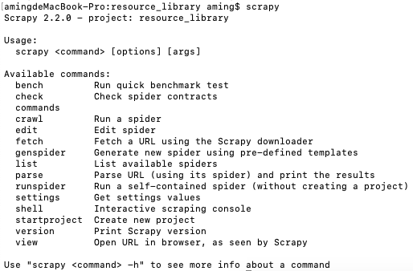

<h1 align="center">Resource Library</h1>

## 安装
```
https://github.com/Tecode/resource_library.git

pip install pillow
pip install scrapy
pip install scrapy-splash
pip install pymysql
```

## 安装`Docker`,安装`splash`

```bash
sudo apt install docker.io
sudo systemctl start docker
sudo systemctl enable docker
docker -v

sudo docker pull scrapinghub/splash
sudo docker run -it -p 8050:8050 scrapinghub/splash
```

## 使用

### 进入文件夹输入`scrapy`,命令行有`scrawl`,如下图

<p align="center">
    
</p>

### 命令

```
scrapy genspider name[baidu] webSite[http://baidu.com]

scrapy crawl girlImage        // 爬去的是一个美女网站的封面图片,都是小图
scrapy crawl imageDetail      // 爬去的是一个美女网站的大图
scrapy crawl chinaz    // 爬取ChinaZ网站的PSD素材
scrapy crawl jdBookWeb        // 爬取京东网站,需要scrapy-splash


```

## 注意

### `reptile/settings.py`修改你的图片存储的位置

```
# 保存图片地址
IMAGES_STORE = '/home/xm/testFile/spider/.vscode/images' #修改你的图片存储位置
```
